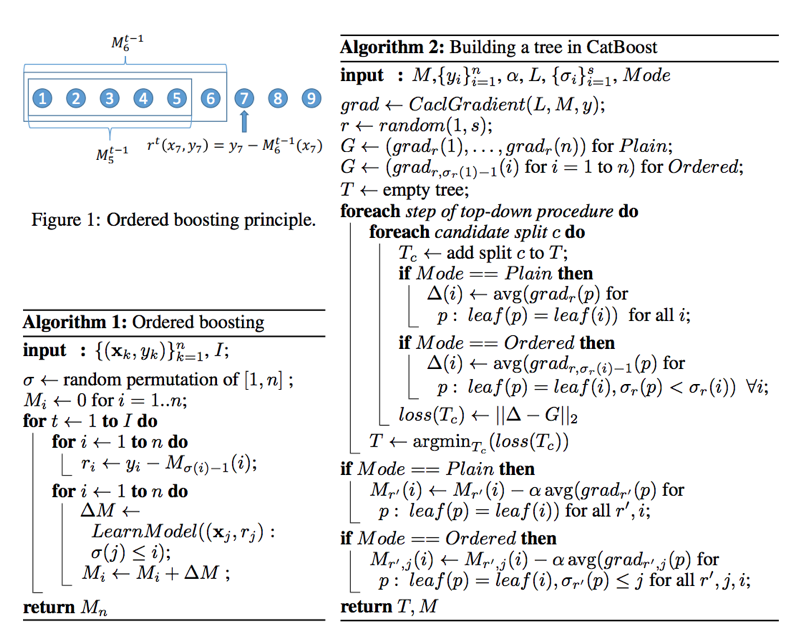

# machine-learning-note
This is a note for machine learning

1. XgBoost
  a. Pre-sorting:
    i. For each node, enumerate over all features
    ii. For each feature, sort the instances by feature value
    iii. Use linear scan to decide the best split along that feature basis information gain.
    iv. Take the best split solution along all the features
  b. Histogram-based:
    i. Split all data points for a feature into discrete bins
    ii. Uses these bins to find the best split value of histogram
2. LightGBM
  a. Gradient-based One-Side Sampling (GOSS)
    i. Keeps all the instances with large gradients and performs random sampling on the instances with small gradients
    ii. Training instances with small gradients have smaller training error and it is already well-trained.
    iii. To achieve good balance between reducing the number of data instances and keeping the accuracy for learned decision trees, GOSS introduces a constant multiplier for the data instances with small gradients
3. CatBoost
  a. Practical implement of orderd boosting
  b. Permutating the set of input observations in a random order, multiple random permutations are generated
  c. Converting the label value from a floating point or category to an integer
  d. Transform all categorical feature to numeric values using avg\_target=(countInClass+prior)/(totalCount+1)    
    i. countInClass is how many times the label value was equal to "1" for objects with the current categorical feature value.
    ii. TotalCount is the total number of objects that have a categorical feature value matching the current one

